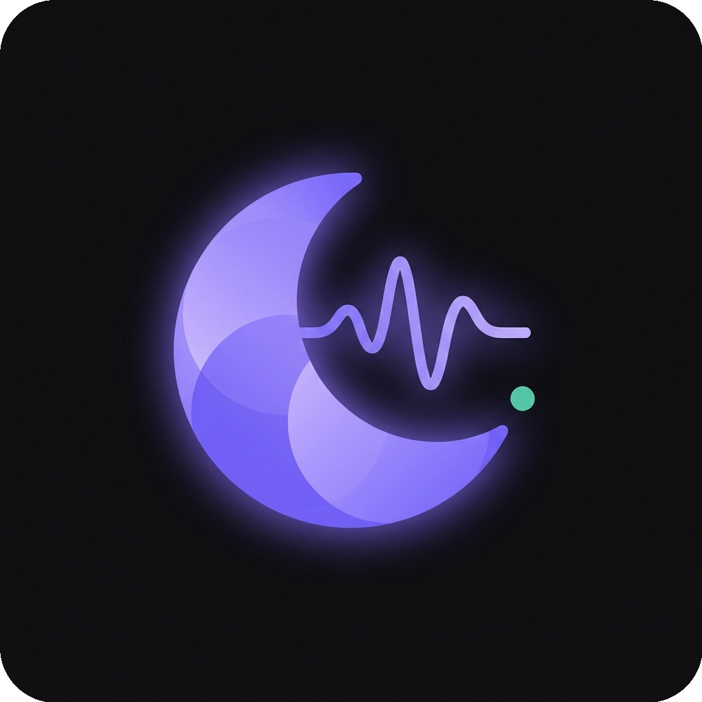
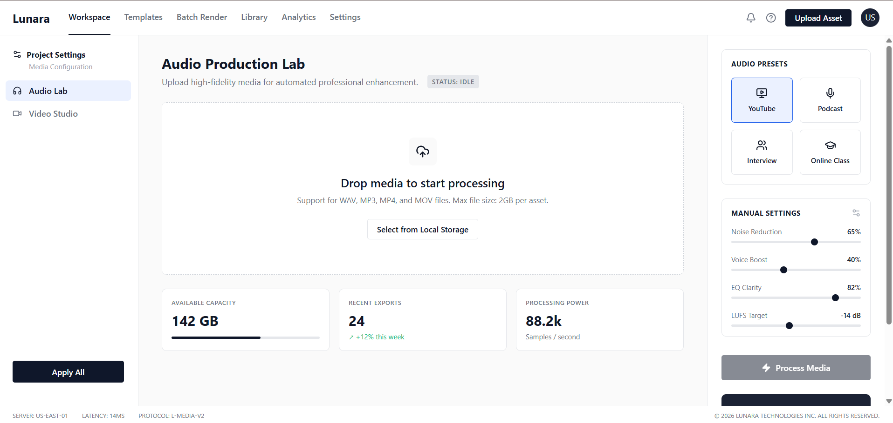
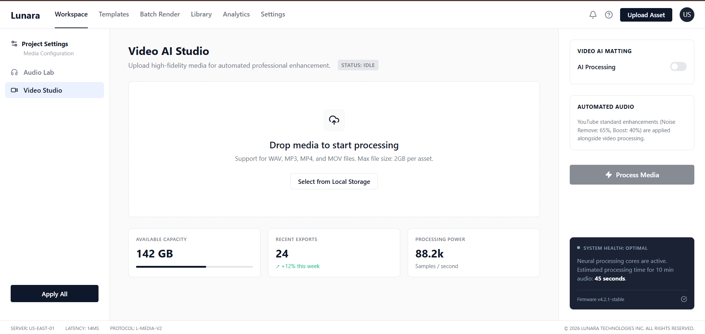

<p align="center">
  
</p>

<h1 align="center">Lunara</h1>

<p align="center">
  <strong>AI-Powered Video & Audio Enhancement Platform</strong>
</p>

<p align="center">
  <a href="https://github.com/lunara-org/lunara/blob/main/LICENSE">
    
  </a>
  <a href="https://github.com/lunara-org/lunara/releases">
    
  </a>
  <a href="https://github.com/lunara-org/lunara/stargazers">
    
  </a>
  <a href="https://github.com/lunara-org/lunara/network/members">
    
  </a>
</p>

---

## Screenshots

<p align="center">
  
  &nbsp;
  
</p>

<p align="center">
  <em>Audio Lab (Left) · Video Studio (Right)</em>
</p>

---

## Overview

**Lunara** is an open-source AI-powered media enhancement platform designed for content creators, podcasters, educators, and video professionals. It combines advanced audio processing, AI-driven video effects, and professional-grade batch rendering workflows in a unified, modern interface.

### Key Features

| Feature | Description |
|---------|-------------|
| **Audio Lab** | Professional audio enhancement with noise reduction, voice boost, EQ clarity, and LUFS normalization |
| **Video Studio** | AI background removal using MediaPipe, custom backgrounds, cinematic filters, skin smoothing, and light matching |
| **Workflow Editor** | Visual NLE (Non-Linear Editor) with multi-track timeline for template-based video creation |
| **Batch Rendering** | Process multiple videos with automatic caption generation and thumbnail creation |
| **Live Preview** | Real-time preview of video effects before processing |
| **Smart Captions** | AI-powered transcription using OpenAI Whisper with SRT export and subtitle burning |

---

## Tech Stack

### Backend
- **FastAPI** - High-performance Python web framework
- **MongoDB** - Document database for assets, templates, and analytics
- **FFmpeg** - Industry-standard multimedia processing
- **OpenCV** - Computer vision and image processing
- **MediaPipe** - Google's ML solutions for selfie segmentation
- **OpenAI Whisper** - State-of-the-art speech recognition
- **NumPy/SciPy** - Scientific computing and audio processing

### Frontend
- **React 19** - Modern UI library with hooks
- **Vite** - Next-generation frontend tooling
- **Lucide React** - Beautiful, consistent iconography

### Infrastructure
- **Docker** - Containerization for consistent deployments
- **Railway/Vercel** - Cloud deployment platforms

---

## Quick Start

### Prerequisites
- Python 3.11+
- Node.js 18+
- MongoDB instance (local or Atlas)
- FFmpeg installed on system

### Backend Setup

```bash
cd backend
python -m venv venv
source venv/bin/activate  # On Windows: venv\Scripts\activate
pip install -r requirements.txt

# Set environment variables
cp .env.example .env
# Edit .env with your MongoDB URI and BASE_URL

# Run the server
uvicorn main:app --reload --port 8000
```

### Frontend Setup

```bash
cd frontend
npm install
npm run dev
```

### Docker Deployment

```bash
docker build -t lunara-backend ./backend
docker run -p 8000:8000 lunara-backend
```

---

## Project Structure

```
Lunara/
├── backend/
│   ├── main.py              # FastAPI application entry
│   ├── audio_processor.py   # Audio enhancement engine
│   ├── render.py            # Video rendering and NLE assembly
│   ├── template.py          # Template data models
│   ├── captions.py          # Whisper transcription
│   ├── thumbnail.py         # Thumbnail generation
│   └── requirements.txt     # Python dependencies
├── frontend/
│   ├── src/
│   │   ├── App.jsx          # Main application
│   │   ├── Workflows.jsx    # Template builder & batch render
│   │   └── NLETimeline.jsx # Timeline editor component
│   └── package.json         # Node dependencies
└── README.md
```

---

## Architecture

```
┌─────────────────┐     ┌──────────────────┐     ┌─────────────────┐
│   Frontend      │────▶│   FastAPI        │────▶│   MongoDB       │
│   (React/Vite)  │◀────│   (Python)       │◀────│   (Database)    │
└─────────────────┘     └──────────────────┘     └─────────────────┘
                               │
                               ▼
                        ┌──────────────────┐
                        │   FFmpeg         │
                        │   OpenCV         │
                        │   MediaPipe      │
                        │   Whisper        │
                        └──────────────────┘
```

---

## API Endpoints

| Endpoint | Method | Description |
|----------|--------|-------------|
| `/api/enhance` | POST | Process audio/video enhancement |
| `/api/preview` | POST | Generate real-time effect preview |
| `/api/ws/{task_id}` | WebSocket | Real-time progress updates |
| `/api/library` | GET/DELETE | Manage processed assets |
| `/api/templates` | GET/POST | Video template CRUD |
| `/api/render/batch` | POST | Start batch rendering job |
| `/api/render/{job_id}` | GET | Check render job status |

---

## Contributing

We welcome contributions from the community! Whether you're fixing bugs, adding features, or improving documentation, your help is appreciated.

📖 **[📋 View our comprehensive Contributing Guide](CONTRIBUTING.md)**

### Quick Start for Beginners

1. **🍴 Fork** the repository
2. **📥 Clone** your fork: `git clone https://github.com/YOUR_USERNAME/lunara.git`
3. **🌿 Create** a branch: `git checkout -b feature/your-feature-name`
4. **💻 Make** your changes with clear commits
5. **⬆️ Push** to your fork and **🔄 Open Pull Request**

### Ways to Contribute

| Type | Description | Time Commitment |
|------|-------------|-----------------|
| 🐛 **Bug Reports** | Find and report issues | 5-15 minutes |
| 💡 **Feature Ideas** | Suggest new functionality | 10-20 minutes |
| 📝 **Documentation** | Improve docs, wiki, README | 30-60 minutes |
| 🧪 **Testing** | Write or improve tests | 1-2 hours |
| 💻 **Code** | Fix bugs or implement features | 2-8 hours |

### Need Help?
- 💬 **[GitHub Discussions](https://github.com/Amrit-raj50/Lunara/discussions)** - Questions and help
- 📚 **[Wiki](https://github.com/Amrit-raj50/Lunara/wiki)** - Documentation and guides
- 🐛 **[Issues](https://github.com/Amrit-raj50/Lunara/issues)** - Bug reports and feature requests

---

## Roadmap

- [ ] **Cloud Storage Integration** - AWS S3, Google Cloud Storage support
- [ ] **Plugin System** - Third-party effect plugins
- [ ] **Collaborative Editing** - Real-time multi-user templates
- [ ] **Mobile App** - iOS and Android companion apps
- [ ] **GPU Acceleration** - CUDA support for faster processing
- [ ] **Advanced Color Grading** - LUT support and color wheels

---

## Community

- **Discord**: [Join our community](https://discord.gg/lunara) *(placeholder)*
- **Discussions**: Use GitHub Discussions for Q&A
- **Twitter**: [@LunaraOrg](https://twitter.com/LunaraOrg) *(placeholder)*

---

## License

Lunara is licensed under the [MIT License](LICENSE).

```
MIT License

Copyright (c) 2026 Lunara Organization

Permission is hereby granted, free of charge, to any person obtaining a copy
of this software and associated documentation files (the "Software"), to deal
in the Software without restriction, including without limitation the rights
to use, copy, modify, merge, publish, distribute, sublicense, and/or sell
copies of the Software, and to permit persons to whom the Software is
furnished to do so, subject to the following conditions:

The above copyright notice and this permission notice shall be included in all
copies or substantial portions of the Software.
```

---

## Acknowledgments

- [FFmpeg](https://ffmpeg.org/) - The gold standard for multimedia processing
- [MediaPipe](https://mediapipe.dev/) - Google's ML solutions
- [OpenAI Whisper](https://github.com/openai/whisper) - Open-source speech recognition
- [FastAPI](https://fastapi.tiangolo.com/) - Modern Python web framework
- [React](https://react.dev/) - UI library that powers our frontend

---

<p align="center">
  Built with 💜 by the Lunara community
</p>